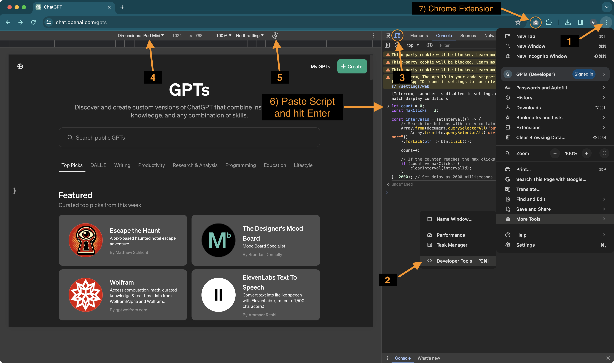

### Chrome plugin
Install "GoFullPage"
https://chromewebstore.google.com/detail/gofullpage-full-page-scre/fdpohaocaechififmbbbbbknoalclacl

### Script to Automatic Click "Show More" Buttons

Below is the JavaScript script that can be executed in the browser's console (Developer Tools). It is designed to automatically find and click any button containing "See more". The script will perform this click action three times, with a two-second interval between each set of clicks because some lists require multiple clicks until they are fully showed.

```javascript
let count = 0; 
const maxClicks = 3; 

const intervalId = setInterval(() => {
    // Search for buttons with a div containing "See more" and click each one
    Array.from(document.querySelectorAll('button')).filter(btn => 
        Array.from(btn.querySelectorAll('div')).some(div => div.textContent.includes("See more"))
    ).forEach(btn => btn.click());

    count++; 

    // If the counter reaches the max clicks, clear the interval
    if (count >= maxClicks) {
        clearInterval(intervalId);
    }
}, 2000); // Set delay as 2000 milliseconds (2 seconds)
```

### Steps to Capture the Screenshots
Capture one screenshot with the lists closed (not fully shown when the page loads), then run the script above and capture another screenshot with the lists fully shown.

