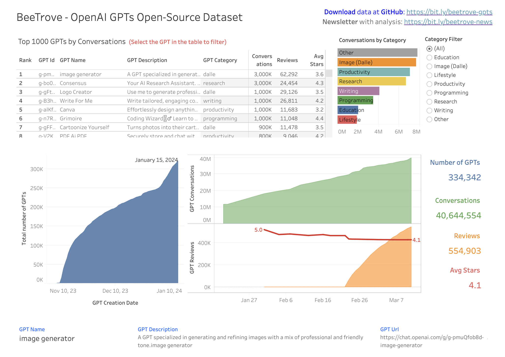
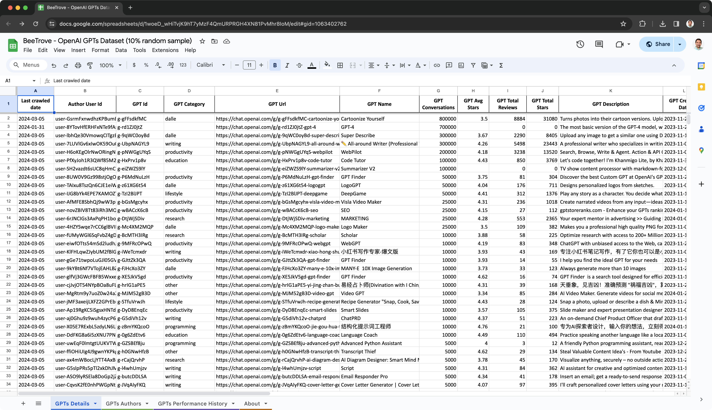

## BeeTrove - OpenAI GPTs Dataset

This OpenAI Custom GPTs dataset is meant to be a treasure trove offering insights for research, development, business, and pure curiosity. It contains detailed historical data about around 349K Custom GPTs. This dataset is completely free, it is Apache 2.0.

This project aims to spark community collaboration, encouraging everyone to explore, uncover insights, and enhance our collective grasp of Custom GPTs. Feel free to share your findings and let people know where you found the data.

Here is an [example dashboard](https://beetrove.com/) with just a few ideas of what is possible with this data:

[](https://beetrove.com/)

[](https://docs.google.com/spreadsheets/d/1woeD_wHiTvjK9hT7yMzF4QmURPRGH4XN81PvMhr8IoM/edit?usp=sharing)

### 1) Downloading the data

- **Step 1:** Begin by examining the 5% random data sample provided in this [Excel](./GPTs_5_percent_random_sample.xlsx) or [Google Sheets](https://docs.google.com/spreadsheets/d/1woeD_wHiTvjK9hT7yMzF4QmURPRGH4XN81PvMhr8IoM/edit?usp=sharing) file, which includes 3 sheets. Please note that due to the inherent limitations on data capacity of both Excel and Google Sheets, it's not feasible to analyze the full dataset directly within these platforms.
- **Step 2:** To work with the full dataset, please download the larger files from [Google Drive](https://drive.google.com/drive/folders/1hUGnQ_AWeL2wi5UhUTt05dMHYb_FIvz4?usp=drive_link). In the "Final tables" folder (ETL Stage 3), you will find CSV files in a format similar to the 5% random sample file.
- **Step 3:** You can dive even deeper in the data by analyzing the historical and raw data available in the folders ETL Stage 1 and 2 in [Google Drive](https://drive.google.com/drive/folders/1hUGnQ_AWeL2wi5UhUTt05dMHYb_FIvz4?usp=drive_link).


### 2) Important Observations for Analysis

Understanding how the data is generated is crucial for proper interpretation:

#### 2.1) Discovering Public GPTs

- Started by crawling the web, similar to how Google and Bing do, over several days, finding a total of 349K Custom GPTs.

#### 2.2) Monitoring GPTs Details

- Began monitoring these 349K GPTs on **2024-01-20**. No new GPTs have been added to the monitoring since then.

#### 2.3) Monitoring OpenAI GPT Store Homepage

- Initiated on **2024-03-02**. The goal is to observe how visibility on the home page affects GPT metrics such as Conversations, Reviews, Ratings, etc.
- Significant changes in the home list will also be documented with screenshots.

### 3) How data was processed

ETL (Extract, Transform, and Load) is a process used to gather and prepare data for analysis.

- **Stage 1**: Extracted raw nested JSON data by crawling GPT pages.
- **Stage 2**: Transformed nested JSON data into flat CSV files.
- **Stage 3**: Normalized data by processing the full history to compile simpler tables that contain the latest details and a timeline of performance metrics (Conversations, Stars, Reviews). These are the "Final tables" (ETL Stage 3) and the sample data in Excel.
  
### Newsletter

[Subscribe to receive updates and interesting analysis](https://forms.gle/8jfH2dT8ReTyDCv89)


### License

**Apache License 2.0:** This permissive open-source license allows for free use, modification, distribution, and commercial exploitation of the software, provided that proper attribution and the license text are included in redistributed works.

### About the author

[André Mafei](https://www.linkedin.com/in/andremafei/) is an independent analytics consultant. You can hire his services to help with:
- Finding insights in this data for your company or research
- Joining this data with data from your company or research

#### Citation Guide

If you use the BeeTrove OpenAI GPTs dataset in your work, please cite it as follows to acknowledge its source:

##### APA:
Mafei, A. (2024). BeeTrove OpenAI GPTs Dataset. Upmize Inc. Available at [https://github.com/beetrove/openai-gpts-data](https://github.com/beetrove/openai-gpts-data). Apache License 2.0.

##### MLA:
Mafei, André. "BeeTrove OpenAI GPTs Dataset." Upmize Inc, 2024, [https://github.com/beetrove/openai-gpts-data](https://github.com/beetrove/openai-gpts-data). Apache License 2.0.

##### BibTeX:
```bibtex
@misc{beetrove2024gpts,
  author = {Mafei, André},
  title = {BeeTrove OpenAI GPTs Dataset},
  year = {2024},
  publisher = {Upmize Inc},
  howpublished = {\url{https://github.com/beetrove/openai-gpts-data}},
  note = {Apache License 2.0}
}
```

### Data source

Data was crawled in compliance with OpenAI's guidelines, as specified in [OpenAI's robots.txt](https://chat.openai.com/robots.txt).
